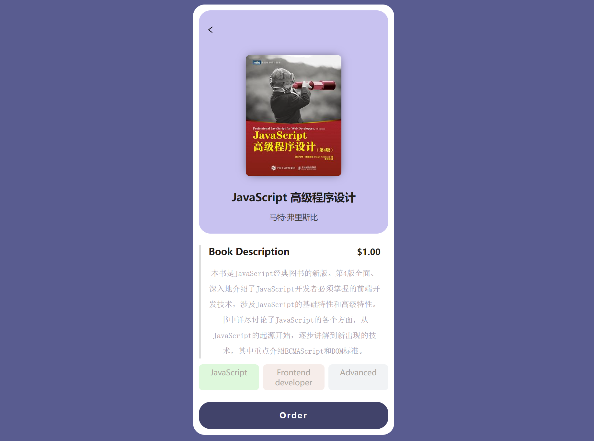

# paypal-payment-demo
A demo for paypal payment. It demonstrates how to fulfill successful orders for an e-book using the PayPal REST API.


## Instructions

1. Create a file ./server/.env and add PayPal sandbox account:
```
CLIENT_ID=<YOUR_CLIENT_ID>
CLIENT_SECRET=<YOUR_CLIENT_SECRET>
```
2. 

```
cd ./server

npm install

npm run dev
```

3. 

```shell
cd ./client

npm install

npm run dev
```

4. Open http://localhost:5173 you will see



## Resources
* https://www.npmjs.com/package/@paypal/react-paypal-js
* https://developer.paypal.com/docs